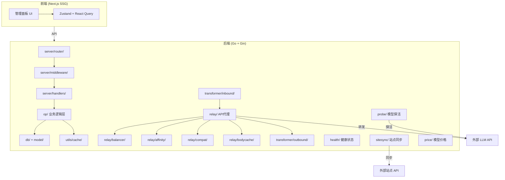

# CLAUDE.md

This file provides guidance to Claude Code (claude.ai/code) when working with code in this repository.

## 开发命令

### 后端 (Go)
```bash
go run main.go start                # 启动服务 (默认 0.0.0.0:8080)
go run main.go start --config path  # 指定配置文件
go test ./...                       # 运行所有测试
```

### 前端 (Next.js)
```bash
cd web
pnpm install                        # 安装依赖
pnpm dev                            # 开发服务器 (localhost:3000)
NEXT_PUBLIC_API_BASE_URL="http://127.0.0.1:8080" pnpm dev  # 指定后端地址
pnpm build                          # 生产构建 (输出到 web/out/)
pnpm lint                           # ESLint 检查
```

### 完整构建
```bash
cd web && pnpm install && pnpm build && cd ..
mv web/out static/
go run main.go start
```

### 跨平台发布
```bash
./scripts/build.sh build linux x86_64   # 构建指定平台
./scripts/build.sh release              # 构建所有平台
```

### Docker
```bash
docker compose up -d
```

## 架构概览

Octopus 是一个 **LLM API 聚合与负载均衡服务**。Go 后端 (Gin + GORM) 提供 API 代理和管理接口，Next.js 前端提供管理面板。

**启动流程**: `main.go` → `cmd/start.go` → 初始化 Config → DB → Cache → HTTP Server → Background Tasks

**请求流**: Gin Router → Middleware (Auth/CORS/Logger) → Handler → Op (业务逻辑) → DB/Cache

**API 代理流**: Request → Inbound Transformer (协议转换) → Relay → Balancer (负载均衡/熔断) → 外部 LLM API → Outbound Transformer → Response

## 架构图



## 后端关键模块 (`internal/`)

### 核心层

| 模块 | 职责 |
|------|------|
| `conf/` | Viper 配置管理，env 前缀 `OCTOPUS_`，默认读取 `data/config.json` |
| `db/` | GORM 数据库层，支持 SQLite(默认)/MySQL/PostgreSQL，`db/migrate/` 含迁移 |
| `model/` | 数据模型定义 (Channel, Group, User, APIKey, Setting, Site, Stats 等) |
| `op/` | **业务逻辑层 (Service)**，包含内存缓存管理，Handler 调用此层而非直接操作 DB |
| `client/` | LLM 提供商 HTTP 客户端封装 |

### 服务层

| 模块 | 职责 |
|------|------|
| `server/handlers/` | HTTP 请求处理器，按资源分文件 (channel, group, site, relay, probe 等) |
| `server/middleware/` | Auth (JWT + API Key)、CORS、Logger、Static、Validate 中间件 |
| `server/router/` | 自定义路由框架，链式注册: `NewGroupRouter(path).Use(mw).AddRoute(route)` |
| `server/auth/` | JWT 生成/验证，API Key 格式 `sk-octopus-*` |
| `server/resp/` | 统一响应格式 `{code, message, data}` |

### API 代理核心

| 模块 | 职责 |
|------|------|
| `relay/` | API 代理核心入口，请求转发、SSE 流、WebSocket、取消、重试、降级 |
| `relay/balancer/` | 负载均衡策略 (RoundRobin/Random/Failover/Weighted) + 熔断器 (circuit.go) |
| `relay/affinity/` | 通道亲和性，同一会话复用同一通道 |
| `relay/compat/` | 兼容性适配 (preflight, service_tier, web_search) |
| `relay/bodycache/` | 请求体缓存，支持重试时重放 |
| `transformer/` | 协议转换适配器入口 |
| `transformer/model/` | 统一中间数据模型 (Message, Request, StreamEvent, Schema 等) |
| `transformer/inbound/` | 入站转换：`openai/` 解析 OpenAI 格式，`anthropic/` 解析 Anthropic 格式 |
| `transformer/outbound/` | 出站转换：`openai/`、`anthropic/`、`gemini/`、`volcengine/` 各提供商格式 |
| `transformer/compat/` | tool_calls 兼容处理、Gemini 签名缓存 |

### 站点与同步

| 模块 | 职责 |
|------|------|
| `site/` | 站点服务入口，委托 `sitesync/` 执行 |
| `sitesync/` | 站点同步核心：账户同步、签到、项目管理、定价、路由探测、批量操作 |
| `price/` | LLM 模型价格管理，从 models.dev 拉取价格表 |

### 健康与探活

| 模块 | 职责 |
|------|------|
| `health/` | 通道健康状态机 (Active→Penalized→Recovering→Quarantined)，环形缓冲区统计 |
| `probe/` | 模型探活：并发探测模型可用性、TTFT，调度器管理探测频率 |

### 辅助与运维

| 模块 | 职责 |
|------|------|
| `helper/` | 通用辅助 (HTTP fetch, 通道工具, 延迟工具, 价格工具) |
| `task/` | 后台定时任务 (统计持久化、模型同步、价格更新、过期清理) |
| `update/` | 自动更新：下载新版本二进制并热替换 |
| `utils/log/` | Zap 结构化日志 |
| `utils/cache/` | 分片缓存 (16 shard, xxhash)，运行时内存缓存 + 关机持久化到 DB |
| `utils/safe/` | 安全执行工具 |
| `utils/shutdown/` | 优雅关机管理 |
| `utils/snowflake/` | Snowflake ID 生成器 |
| `utils/tokenizer/` | Token 计数器 |
| `utils/xslice/` | 切片工具函数 |
| `utils/xstrings/` | 字符串工具函数 |
| `utils/xurl/` | URL/DataURL 工具 |
| `utils/diff/` | Diff 工具 |

## 前端关键模式 (`web/src/`)

- **状态管理**: Zustand (本地/持久化状态) + TanStack React Query (服务端数据缓存，30s 自动刷新)
- **UI**: shadcn/ui + Radix UI 原语 + TailwindCSS v4 + Framer Motion 动画
- **路由**: 自定义 SPA 路由 (`route/config.tsx` 定义，`ContentLoader` 动态加载)，**不使用** Next.js 文件路由
- **API 层**: `api/client.ts` 基于 fetch 的 HTTP 客户端，`api/endpoints/` 按功能导出 React Query hooks
- **i18n**: next-intl，翻译文件位于 `public/locale/{en,zh_hans,zh_hant}.json`
- **构建**: SSG 静态导出 (`output: "export"`)，嵌入到 Go 二进制的 `static/` 目录

### 前端模块 (`components/modules/`)

| 模块 | 职责 |
|------|------|
| `home/` | 首页仪表盘：图表、活动流、排行 |
| `site/` | 站点管理：站点列表、签到面板 |
| `site-channel/` | 站点通道管理：通道列表、绑定、UI 状态 |
| `channel/` | 通道管理：卡片、创建、表单、Tab 切换 |
| `group/` | 分组管理：卡片、创建、编辑器 |
| `model/` | 模型管理：列表、创建、覆盖层 |
| `toolbar/` | 工具栏：搜索框、视图选项 |
| `wizard/` | 快速设置向导：4 步引导流程 |
| `apikey-dashboard/` | API Key 仪表盘 |
| `setting/` | 设置页：系统、账户、外观、备份、日志、LLM 同步/价格、通道健康、熔断器 |
| `log/` | 日志查看 |
| `login/` | 登录页 |
| `navbar/` | 导航栏 |
| `logo/` | Logo 组件 |

### 前端状态与工具

| 路径 | 职责 |
|------|------|
| `stores/` | Zustand stores: `setting.ts` (全局设置), `jump.ts` (跳转) |
| `hooks/` | 自定义 hooks: `use-mobile.ts`, `useClickOutside.tsx` |
| `api/endpoints/` | React Query hooks: apikey, channel, group, log, model, setting, site, site-channel, stats, update, user |
| `route/` | SPA 路由: `config.tsx` (路由定义), `content-loader.tsx`, `error-boundary.tsx`, `lazy-with-preload.ts` |
| `lib/` | 工具库: `animations/` (动画配置) |
| `provider/` | React Context Providers |
| `components/ui/` | shadcn/ui 基础组件 |
| `components/common/` | 通用业务组件 |
| `components/animate-ui/` | 动画 UI 原语 (tabs, tooltip, slot, highlight) |

## 配置

运行时配置 `data/config.json`（首次运行自动生成），所有字段可通过 `OCTOPUS_` 前缀环境变量覆盖:
- `OCTOPUS_SERVER_PORT`, `OCTOPUS_SERVER_HOST`
- `OCTOPUS_DATABASE_TYPE` (sqlite/mysql/postgres), `OCTOPUS_DATABASE_PATH`
- `OCTOPUS_LOG_LEVEL`

数据库运行时设置 (CORS 等) 存储在 `Setting` 模型中，通过 `op/setting.go` 缓存访问。

## 贡献规范

- 每个 PR 只包含一个变更主题（一个功能或一个 BUG 修复）
- AI 辅助代码需完成人工审查后提交

## 上游同步策略（铁律）

本项目从 [metapi](https://github.com/Hureru/metapi) 移植功能。为保持与上游的同步能力，所有自定义修改必须遵循以下规则：

1. **扩展优先**：新增功能优先放在新文件（如 `xxx_ext.go`、`xxx_plus.go`）中，而非直接修改上游已有文件
2. **纯新增字段安全**：在上游结构体中添加新字段是安全的（纯增量，不影响上游），可直接修改
3. **函数签名不变**：不修改上游已有函数的签名。如需扩展行为，创建新函数（如 `parseSSEStream` 替代 `parseSSEFirstToken`）
4. **Handler 层扩展**：API 参数扩展（如 `model_names`、`prompt`、`delay_ms`）在 handler 层处理，不改变底层模块接口
5. **前端独立组件**：新增 UI 组件（如 `ProbeModal`）放在对应模块目录下，不修改上游已有组件的核心逻辑
6. **冲突预防**：如果上游可能新增同名字段/函数，使用 wrapper 模式或在 `_ext.go` 文件中隔离
