# web/src/components/modules/ - 业务模块组件

> 导航：[根目录](../../../../CLAUDE.md) > [web](../../../CLAUDE.md) > src > components > **modules**

## 职责

按功能拆分的业务组件。每个子目录对应一个面板/页面，自带状态、API hook 调用、UI 渲染。

## 模块总览

```mermaid
graph TD
    Home["home/<br/>首页仪表盘"]
    Site["site/<br/>站点管理"]
    SiteChannel["site-channel/<br/>站点通道"]
    Channel["channel/<br/>通道管理"]
    Group["group/<br/>分组管理"]
    Model["model/<br/>模型管理"]
    Wizard["wizard/<br/>4 步快速向导"]
    Setting["setting/<br/>设置面板"]
    Log["log/<br/>日志查看"]
    APIKeyDash["apikey-dashboard/<br/>API Key 仪表盘"]
    Login["login/<br/>登录页"]
    Navbar["navbar/<br/>导航栏"]
    Toolbar["toolbar/<br/>搜索/视图工具栏"]
    Logo["logo/<br/>Logo 组件"]
```

## 模块清单

| 模块 | 主要文件 | 一句话职责 |
|------|---------|-----------|
| `home/` | `index.tsx`, `chart.tsx`, `activity.tsx`, `rank.tsx`, `group-health-overview.tsx`, `group-health-summary-strip.tsx`, `store.ts` | 仪表盘：图表 + 活动流 + 排行 + 分组健康 |
| `site/` | `index.tsx`, `CheckinPanel.tsx`, `checkin-status.ts`, `ui-store.ts`, `site-message.ts` | 站点列表、Free/Paid Tab 切换、签到面板、消息显示 |
| `site-channel/` | `index.tsx`, `constants.ts`, `ui-store.ts`, `utils.ts` | 站点同步生成的通道管理 |
| `channel/` | `index.tsx`, `Create.tsx`, `Form.tsx`, `Card.tsx`, `CardContent.tsx`, `TabSwitcher.tsx`, `tab-store.ts`, `ProbeModal.tsx`, `ChannelFilterPanel.tsx`, `probePrompts.ts` | 通道 CRUD、探测、过滤 |
| `group/` | `index.tsx`, `Create.tsx`, `Editor.tsx`, `ItemList.tsx`, `Card.tsx`, `health.tsx`, `utils.ts` | 分组 CRUD、健康展示 |
| `model/` | `index.tsx`, `Item.tsx`, `Create.tsx`, `ItemOverlays.tsx` | LLM 模型列表/创建 |
| `wizard/` | `index.tsx`, `Step1AddSite.tsx`, `Step2Sync.tsx`, `Step3Filter.tsx`, `Step4Group.tsx`, `StepIndicator.tsx`, `QuickStartCard.tsx`, `store.ts` | 4 步引导：加站点 -> 同步 -> 过滤 -> 建组 |
| `setting/` | `index.tsx`, `System.tsx`, `Account.tsx`, `Appearance.tsx`, `Backup.tsx`, `Log.tsx`, `LLMSync.tsx`, `LLMPrice.tsx`, `SiteAutomation.tsx`, `ChannelHealth.tsx`, `CircuitBreaker.tsx`, `APIKey.tsx`, `Info.tsx` | 系统设置多 Tab 面板 |
| `log/` | `index.tsx`, `Item.tsx` | 请求日志查询/展示 |
| `apikey-dashboard/` | `index.tsx` | API Key 仪表盘 |
| `login/` | `index.tsx` | 登录页 |
| `navbar/` | `index.ts`, `navbar.tsx` | 顶部/侧边导航栏 |
| `toolbar/` | `index.tsx`, `search-store.ts`, `view-options-store.ts` | 跨模块复用的搜索/视图工具栏；新增 `SiteTypeTab`（`free`/`paid`）状态与 `setSiteTypeTab` |
| `logo/` | `index.tsx` | Logo SVG 组件 |

## site_type 功能在前端的分布

### toolbar/view-options-store.ts
- 新增 `SiteTypeTab = 'free' | 'paid'` 类型
- store 新增 `siteTypeTab: SiteTypeTab` 状态（默认 `free`，持久化到 localStorage）
- 新增 `setSiteTypeTab` setter

### toolbar/index.tsx
- 当 `siteTypeTab === 'paid'` 时，隐藏"全量签到"按钮

### site/index.tsx
- 顶部渲染 Free / Paid 两个 Tab 切换按钮，切换 `siteTypeTab`
- 站点列表按 `site_type` 过滤显示
- `paid` 站点的卡片隐藏签到状态、签到按钮、随机签到相关 UI
- 创建站点对话框增加 `site_type` 选择器（默认 `free`）

### wizard/Step1AddSite.tsx
- 创建站点时固定 `site_type: 'free'`

## 通用约定

- 每个模块导出 `index.tsx` 作为路由入口（由 `route/config.tsx` 懒加载）
- 模块内部状态用 Zustand store（命名 `<module>-store.ts` 或 `store.ts`）
- 服务端数据通过 `api/endpoints/*` 的 React Query hooks 获取
- UI 原语来自 `components/ui/`（shadcn）与 `components/animate-ui/`

## 上游同步注意事项

- 新增 UI 组件（如 `ProbeModal`、`ChannelFilterPanel`）放在对应模块目录下，**不修改上游已有组件的核心渲染逻辑**
- 跨模块共用的小组件提到 `components/common/`，避免循环依赖

## 变更记录 (Changelog)

| 日期 | 变更 |
|------|------|
| 2025-05-21 | 站点类型分离功能：toolbar 新增 `SiteTypeTab` 状态；site 模块新增 Free/Paid Tab 切换与条件渲染；wizard Step1 创建时默认 `free` |
